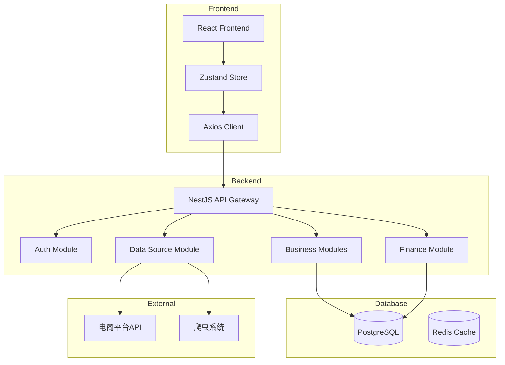
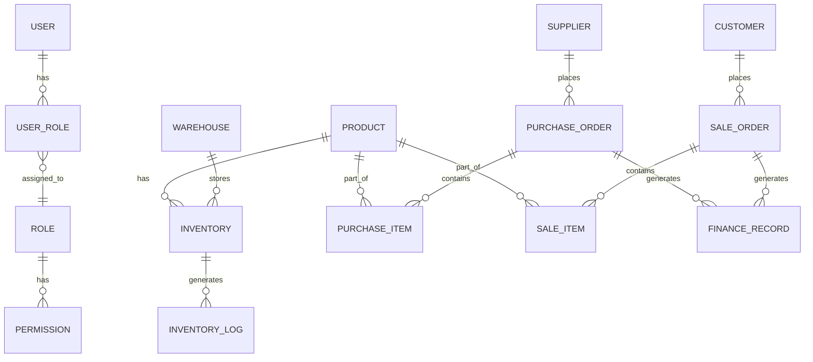
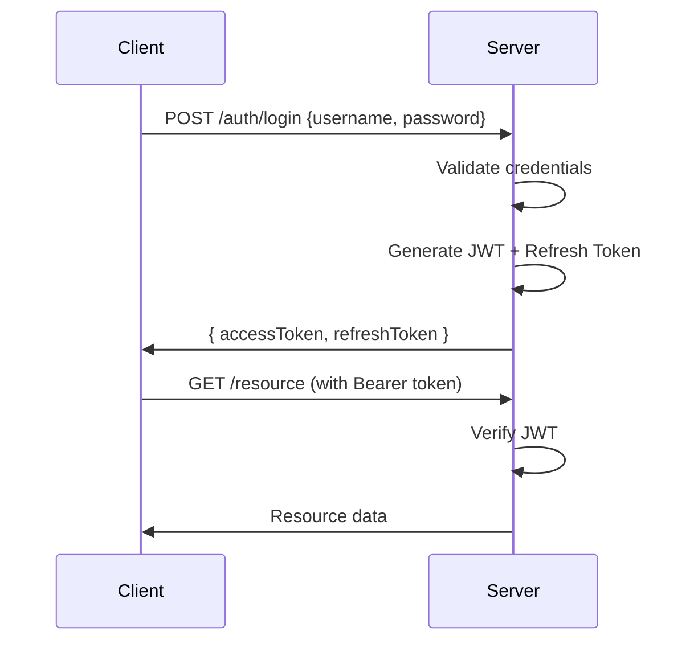
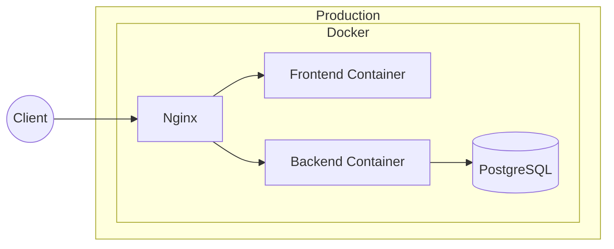

# 电商ERP系统 - 技术架构文档

## 1. 系统架构图



## 2. 模块架构

### 2.1 后端模块结构

```
backend/src/
├── modules/
│   ├── auth/                    # 认证模块
│   │   ├── controllers/
│   │   ├── services/
│   │   ├── dto/
│   │   ├── entities/
│   │   └── auth.module.ts
│   │
│   ├── user/                    # 用户模块
│   │   ├── controllers/
│   │   ├── services/
│   │   ├── dto/
│   │   └── entities/
│   │
│   ├── product/                 # 商品模块
│   ├── inventory/               # 库存模块
│   ├── purchase/                # 采购模块
│   ├── sale/                    # 销售模块
│   ├── finance/                 # 财务模块
│   ├── analytics/               # 数据分析模块
│   └── data-source/             # 数据源模块
│       ├── api/                 # API对接
│       └── spider/               # 爬虫系统
│
├── common/                      # 公共组件
│   ├── decorators/
│   ├── filters/
│   ├── guards/
│   ├── interceptors/
│   └── pipes/
│
├── config/                      # 配置
│   ├── database.config.ts
│   ├── jwt.config.ts
│   └── app.config.ts
│
└── database/                    # 数据库
    ├── entities/
    └── migrations/
```

### 2.2 前端模块结构

```
frontend/src/
├── components/
│   ├── common/                  # 通用组件
│   │   ├── Table/
│   │   ├── Form/
│   │   ├── Modal/
│   │   └── Charts/
│   │
│   ├── layout/                  # 布局组件
│   │   ├── Sider/
│   │   ├── Header/
│   │   └── Footer/
│   │
│   └── charts/                  # 图表组件
│
├── pages/                       # 页面
│   ├── dashboard/              # 仪表盘
│   ├── products/               # 商品管理
│   ├── inventory/              # 库存管理
│   ├── purchases/              # 采购管理
│   ├── sales/                  # 销售管理
│   ├── finance/                # 财务管理
│   └── settings/               # 系统设置
│
├── services/                   # API服务
│   ├── api.ts
│   ├── auth.service.ts
│   └── ...
│
├── store/                      # 状态管理
│   ├── index.ts
│   ├── auth.store.ts
│   └── ...
│
└── types/                      # 类型定义
```

## 3. 数据库设计

### 3.1 核心实体关系



### 3.2 核心表结构

#### 用户与权限
- `users` - 用户表
- `roles` - 角色表
- `permissions` - 权限表
- `user_roles` - 用户角色关联表
- `role_permissions` - 角色权限关联表

#### 业务表
- `products` - 商品表
- `categories` - 商品分类表
- `suppliers` - 供应商表
- `customers` - 客户表
- `warehouses` - 仓库表
- `inventory` - 库存表
- `inventory_logs` - 库存流水表

#### 订单表
- `purchase_orders` - 采购订单表
- `purchase_items` - 采购明细表
- `sale_orders` - 销售订单表
- `sale_items` - 销售明细表

#### 财务表
- `finance_records` - 财务记录表
- `invoices` - 发票表
- `accounts` - 账户表

## 4. API设计

### 4.1 API路由结构

```
/api/v1/
├── auth/
│   ├── POST   /login
│   ├── POST   /register
│   ├── POST   /refresh
│   └── GET    /profile
│
├── users/
│   ├── GET    /users
│   ├── POST   /users
│   ├── GET    /users/:id
│   ├── PUT    /users/:id
│   └── DELETE /users/:id
│
├── products/
│   ├── GET    /products
│   ├── POST   /products
│   ├── GET    /products/:id
│   ├── PUT    /products/:id
│   └── DELETE /products/:id
│
├── inventory/
│   ├── GET    /inventory
│   ├── POST   /inventory/in
│   ├── POST   /inventory/out
│   └── GET    /inventory/logs
│
├── purchases/
│   ├── GET    /purchases
│   ├── POST   /purchases
│   ├── PUT    /purchases/:id
│   └── POST   /purchases/:id/approve
│
├── sales/
│   ├── GET    /sales
│   ├── POST   /sales
│   ├── PUT    /sales/:id
│   └── POST   /sales/:id/approve
│
├── finance/
│   ├── GET    /finance/records
│   ├── POST   /finance/receivable
│   ├── POST   /finance/payable
│   └── GET    /finance/reports
│
├── analytics/
│   ├── GET    /analytics/dashboard
│   ├── GET    /analytics/sales
│   ├── GET    /analytics/inventory
│   └── GET    /analytics/profit
│
└── data-source/
    ├── GET    /data-source/platforms
    ├── POST   /data-source/sync
    └── GET    /data-source/status
```

### 4.2 统一响应格式

```typescript
// 成功响应
{
  "code": 200,
  "message": "success",
  "data": { ... }
}

// 错误响应
{
  "code": 400,
  "message": "Validation failed",
  "errors": [...]
}
```

## 5. 安全设计

### 5.1 认证流程



### 5.2 权限控制

- JWT Token 有效期: 15分钟 (accessToken)
- Refresh Token 有效期: 7天
- RBAC 权限模型
- 路由守卫 + 装饰器双重校验

## 6. 部署架构



---

*最后更新: 2026-04-23*
